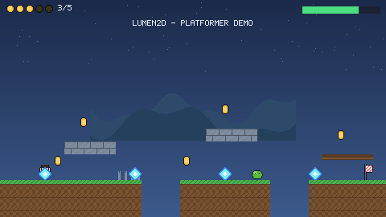
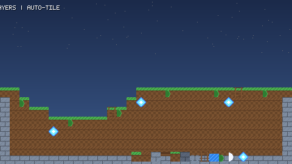
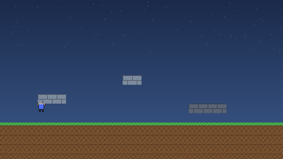
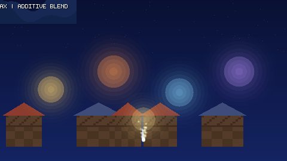

# Lumen2D

A complete 2D game engine and editor, written from scratch in Kotlin — no game-engine
dependencies, no third-party runtime libraries, no build-time code generation. Everything a
game needs (scene graph, physics, renderer, tilemaps, particles, animation, audio, input,
asset pipeline, scripting, editor) is in this repository and readable end to end.

* **Engine** — 25 k lines of Kotlin across `engine-core` (pure Kotlin, runs on any JVM) and two
  backends: `engine-desktop` (windowed player, headless renderer, CLI tooling) and
  `engine-android` (framework-only, `minSdk 24`).
* **Editor** — *Lumen2D Studio*, an Android app with a project hub and a five-panel editor
  (scene tree, inspector, asset browser, script editor, console) running the real engine in a
  live viewport. Same repository, one APK.
* **Assets** — a generated asset library (`base`, CC0) plus an imported third-party pack
  (Kenney Pixel Platformer, CC0) with a **per-file provenance index**: every published file
  records the recipe that made it or the archive it came from, its licence and its import
  settings.
* **Sample games** — three complete projects built by engine code and smoke-tested headlessly in
  CI, so they cannot rot.

|  |  |
| --- | --- |
|  |  |

*(Screenshots are rendered by the engine's own software renderer — `tools/build-local.sh preview`
regenerates them, and CI re-renders them on every push.)*

## Quick start

### Desktop

```bash
tools/bootstrap-toolchain.sh          # offline JDK + Kotlin, no Android SDK needed
tools/build-local.sh all              # compile, run the 125-test suite, build the CLI jar

java -cp "out/classes/core:out/classes/desktop:$HOME/.cache/tools/kotlin/lib/kotlin-stdlib.jar" \
     dev.lumen2d.desktop.LumenDesktopKt --game sample-games/pixel-platformer          # play
java ... dev.lumen2d.desktop.LumenDesktopKt --check sample-games/pixel-platformer --scene scenes/level_1.scene.json
java ... dev.lumen2d.desktop.LumenDesktopKt --demo all --out docs/preview/generated  # screenshots
java ... dev.lumen2d.desktop.LumenDesktopKt --new "My Game" --dir ~/games             # scaffold
```

`tools/build-local.sh` (no arguments = `all`) also accepts `compile`, `test`, `desktop`, `preview`,
`play` and `jar`; `tools/build-local.sh play` launches the platformer in a real window.

### Android

```bash
gradle :app-android:assembleDebug            # with an Android SDK + JDK 17
```

CI builds, verifies and publishes installable APKs on every push to `main`/`arena/*` and on tags —
see the rolling **latest-build** release, which carries `app-android-debug.apk` (debug-signed) and
`app-android-release.apk` (R8-minified, ~570 kB), their SHA-256 checksums, the full verification
report of each APK (package, SDK levels, signature, asset contents) and screenshots from the
emulator run that installs the debug APK and plays a sample game. The APK ships the engine, the
asset library, the provenance index and all three sample games, so a fresh install is playable
offline.

## What's in the box

| Path | What it is |
| --- | --- |
| `engine-core/` | The engine: math, JSON, VFS, scene graph, renderer, physics, tilemaps, particles, animation, audio, input, assets, saves, LumenScript interpreter |
| `engine-desktop/` | Windowed player, headless renderer, preview/screenshot tools, asset-pack builder, sample-game generator, CLI |
| `engine-android/` | Android backends: assets, audio (AudioTrack), input, storage, sharing, project store |
| `app-android/` | Lumen2D Studio: project hub + editor (no Compose — the UI is drawn from framework views) |
| `assets-library/packs/` | Published packs: `base` (17 generated assets) and `kenney` (imported, CC0) |
| `assets-library/sources/` | Per-file provenance index + the vendored third-party archive it was imported from |
| `sample-games/` | `hello-lumen2d`, `pixel-platformer`, `neon-shooter` — complete, playable projects |
| `docs/` | [Engine](docs/ENGINE.md), [scripting](docs/SCRIPTING.md), [assets](docs/ASSETS.md), [editor](docs/EDITOR.md), [Android](docs/ANDROID.md), [building](docs/BUILDING.md), [samples](docs/SAMPLES.md) |
| `tools/` | Offline toolchain bootstrap, build/test runner, Android type checker, APK verifier (+ self-test), emulator smoke test, generators |
| `docs/preview/generated/` | Screenshots rendered by the engine itself (7 demos) |

## Design rules

1. **Zero dependencies.** No libGDX, no Skia, no JSON library, no bitmap font atlas, no Gradle
   plugins beyond the Kotlin/Android ones. The engine parses its own PNG and WAV files, packs its
   own pixels, hashes with `MessageDigest`, and stores everything as JSON.
2. **Deterministic.** The renderer, physics and `Rng` are fixed-step friendly; re-rendering the
   previews twice produces byte-identical PNGs, and the test suite runs without a GPU or a display.
3. **Framework-only Android.** `engine-android` compiles against the platform SDK alone, so the
   engine stays small and works from API 24 up; AndroidX is only used by the Studio app itself.
4. **Everything is a file.** Projects are folders of JSON, packs are folders of art plus sidecar
   metadata, the library records where its files came from. No binary scene format, no opaque
   cache: you can diff a project in Git.
5. **Documented by construction.** The docs describe the code that exists — the CLI flags, node
   list and script builtins in them are the ones the tests exercise.

## Learn more

* [Engine internals and API](docs/ENGINE.md) — subsystems, node types, contracts, performance work.
* [Scripting](docs/SCRIPTING.md) — the LumenScript language, complete builtin reference, recipes.
* [Assets and asset sources](docs/ASSETS.md) — pack format, sidecars, provenance, importers.
* [The editor](docs/EDITOR.md) — Studio's panels and workflows, plus the desktop tooling.
* [Android app](docs/ANDROID.md) — modules, build, CI, offline type checking, APK contents.
* [Building](docs/BUILDING.md) — Gradle and offline builds, tests, CI, releases.
* [Sample games](docs/SAMPLES.md) — what each one demonstrates and how they are generated.

## Licence

The engine source is provided as-is for use in your own projects. Bundled art, sound and fonts in
`assets-library/packs/base` are generated by this repository (CC0-1.0). The imported pack
`assets-library/packs/kenney` comes from Kenney's *Pixel Platformer* kit, released under
[CC0 1.0](https://creativecommons.org/publicdomain/zero/1.0/) — see
`assets-library/packs/kenney/ATTRIBUTION.md` and the vendored licence text in
`assets-library/sources/kenney-pixel-platformer/`.
